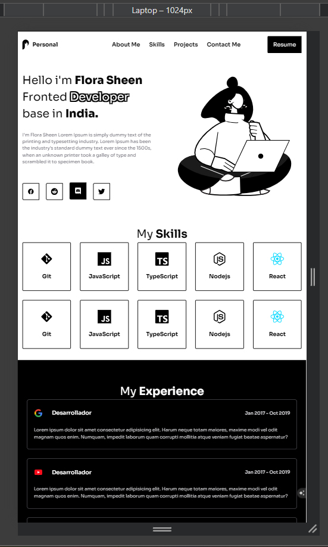
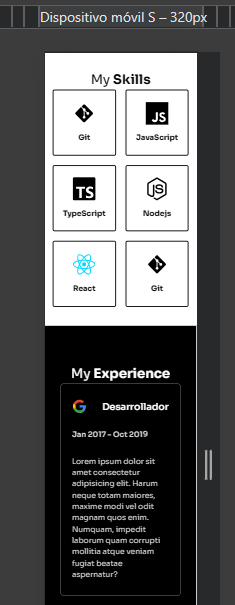

# 💻 Portfolio v1

Este es un proyecto de portafolio personal desarrollado con **React, TypeScript y Vite**.

🚧 **Estado:** En desarrollo (WIP)
Actualmente estoy construyendo y mejorando este proyecto como parte de mi aprendizaje en desarrollo frontend.

---

## 🚀 Tecnologías

* React + Vite ⚡
* TypeScript 🧠
* Tailwind CSS 🎨

---

## 📚 Base del proyecto

Este proyecto está inspirado en un curso de desarrollo web de Platzi, y fue reconstruido utilizando **React y TypeScript** para adaptarlo a un entorno moderno de desarrollo frontend.

---

## ✨ Funcionalidades (en progreso)

* Diseño responsivo 📱
* Sección de proyectos
* Interfaz moderna
* Optimización de rendimiento

---

## 📸 Vista previa del proyecto

Diseño responsivo del portafolio en diferentes dispositivos:

### 💻 Desktop

### 📱 Mobile


---

## 🛠️ Instalación

```bash
# Clonar el repositorio
git clone https://github.com/Vale1702/portfolio-v1.git

# Instalar dependencias
npm install

# Ejecutar el proyecto
npm run dev
```

---

## 📌 Próximas mejoras

* Agregar proyectos reales
* Mejorar UI/UX
* Añadir animaciones
* Deploy en producción

---

## 🙋‍♀️ Sobre mí

Actualmente estoy aprendiendo desarrollo frontend y construyendo proyectos para mejorar mis habilidades.

---

## 📫 Contacto

www.linkedin.com/in/valentina-llorente
